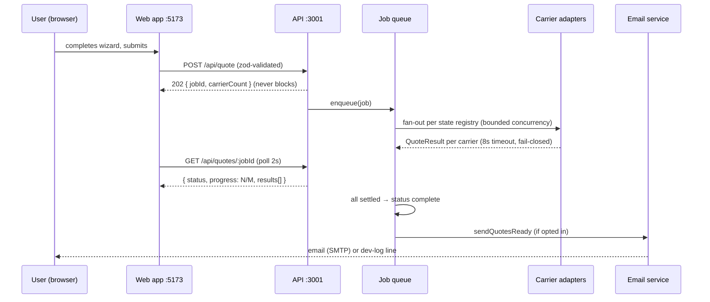
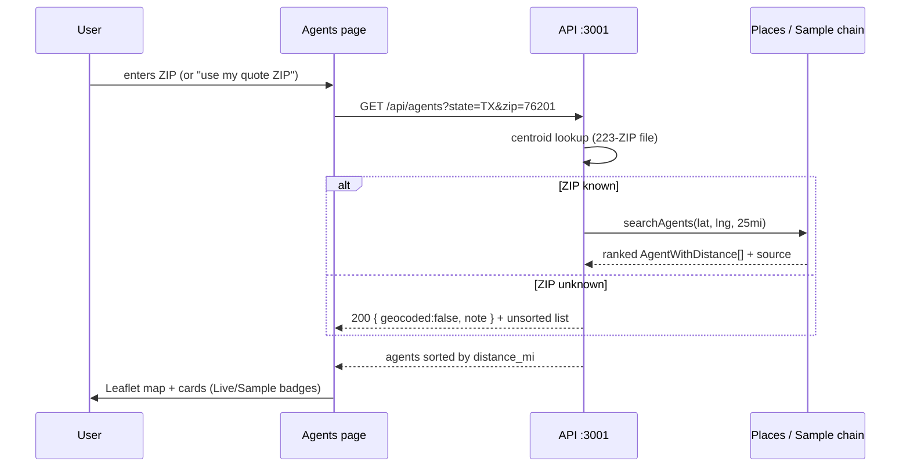

# QuotePilot — AI & Systems Architecture

> Every running process, every decision-making component, every async flow, and
> every interface — plus an honest accounting of what's rules-based today and
> where machine learning would slot in. Last updated: 2026-10-08 (v0.10.1).

## 1. Running processes inventory

Three OS-level services in dev (`scripts/dev.sh`), each independently deployable:

| # | Process | Code | Port | Responsibilities | Inputs | Outputs |
|---|---|---|---|---|---|---|
| 1 | Web app | `apps/web` (Next.js 14.2 App Router + React 18 + TS) | 5173 | All user surfaces: ZIP-first home (SSR SEO shell + client islands), 5-step wizard, quote results + compare, agent finder + map, legal pages (prerendered), cookie banner | User input; REST responses from :3001 (via `/api` rewrite in dev, `NEXT_PUBLIC_API_URL` in prod) | Quote requests; analytics events; server-rendered HTML + metadata |
| 2 | API | `apps/api` (Express + TS) | 3001 | Validation, quote jobs, carrier/agent/disclosure feeds, analytics ingest + summaries, email delivery, rate limiting, security headers | HTTP requests; JSON data files; Google Places + SMTP (env-gated); Redis/Postgres (env-gated) | JSON responses; background jobs; emails; structured logs |
| 3 | Dashboard | `analytics/dashboard` (Vite + TS) | 5174 | Usage monitoring: clicks-by-element, wizard funnel, carrier latency/win-rate, daily sessions | `GET /api/analytics/summary` (30s poll) | SVG charts; `noindex` internal tool |

Inside the API process, the subsystems with their own lifecycles:

| Subsystem | File(s) | Responsibility | Input → Output |
|---|---|---|---|
| Job queue | `services/queue.ts` (`MemoryQueue` / `BullMQQueue`), `services/jobExecutor.ts` | Quote-job lifecycle, bounded-concurrency adapter fan-out, per-carrier 8s timeout, progress tracking. MemoryQueue default; BullMQ when `REDIS_URL` set (jobs survive restarts, any instance serves status). Worker in-process (concurrency 10); graceful shutdown with 15s drain | `QuoteRequest` → `QuoteJob` (queued → running → complete/failed) |
| Quote cache | `services/quoteCache.ts` | Completed-result cache under SHA-256 of rating factors only (email/phone/names never touch the key — tested PII rule); Redis or in-memory LRU; TTL 3600s | Profile hash → cached results (`cached:true`, ~10ms) |
| Analytics sink | `services/analyticsSink.ts` (`SqliteSink` / `PostgresSink`) | `AnalyticsSink` interface; SQLite default, Postgres when `DATABASE_URL` set; fail-open (Postgres outage warns and falls back to SQLite — analytics never breaks quoting) | Client events → sink rows / summaries |
| Carrier adapters | `adapters/*.ts` (6) + `adapters/_base.ts` | Per-carrier pricing behind the frozen `QuoteAdapter` interface | Sanitized `QuoteProfile` → `QuoteResult` (premium, latency, caveats, `simulated` flag) |
| Pricing engine | `lib/pricing.ts`, `lib/hash.ts` | Deterministic simulation math: anchor, personality factors, EV/mileage/accident adjustments, SHA-256 jitter | Profile fields → 6-month premium |
| Agent provider chain | `services/agentProvider.ts` | Places (live) → sample (fallback) agent resolution, 24h cache | lat/lng/radius → ranked `AgentWithDistance[]` |
| Carrier registry | `services/carrierRegistry.ts` | Loads `data/carriers/<STATE>.json`; resolves quotable carriers per state | State code → carrier entries |
| Disclosure registry | `routes/disclosures.ts` + `data/disclosures/` | Per-state insurance notes + verified minimum coverages | State code → notes or 404 (graceful) |
| Geocoder | `data/geocode/zip_centroids.json` | ZIP → approximate lat/lng for distance ranking | 5-digit ZIP → centroid or `geocoded:false` |
| Analytics collector | `services/analyticsService.ts` | Validates taxonomy, hashes sessions, drops PII patterns, persists via the sink abstraction | Client events → sink rows / summaries |
| Email service | `services/emailService.ts` | "Quotes ready" delivery; dev-log mode without SMTP | Job completion → nodemailer send or domain-only log line |
| Logger | `lib/logger.ts` | Structured JSONL, requestId propagation, PII denylist | Everywhere → stdout |
| Rate limiter | `middleware/rateLimit.ts` | Store factory: `rate-limit-redis` when `REDIS_URL` set, else in-memory; tiers via `RATE_LIMIT_*_PER_MIN` | Requests → 429 when over tier |

## 2. Decision-making components

These are the parts of the system that *decide* things — the "intelligence," all
rules-based today:

- **QuoteAdapter engine** (`packages/shared/src/types.ts` + `adapters/`): decides
  *which* carriers run for a state (`adaptersForState`: registry `quotable` ∩
  wired adapters) and *what each costs* (anchor × personality × profile factors).
  The interface is frozen so real carrier APIs replace simulation bodies later.
- **Carrier registry** (`data/carriers/*.json`, 50 states): decides the
  consideration set per state — channels, quotable flags, confidence grades.
  Test-enforced: `quotable ⟹ wired adapter` (`registry.test.ts`, 57 assertions).
- **Agent provider chain** (`agentProvider.ts`): decides *where listings come
  from* (Places when keyed, else labeled sample) and ranks by haversine miles
  from the ZIP centroid. One failing Place Details call never sinks a search.
- **Validation layer** (`lib/validation.ts` web ↔ `lib/schemas.ts` API, mirrored
  regex-for-regex): decides what input is acceptable; drift is a 400-class bug.
- **Analytics aggregation** (`analyticsService.ts` + dashboard): turns raw
  events into funnels, win rates, and latency tables — the feedback loop the
  product team (currently: the owner) uses to decide what to fix next.

## 3. Async flows

### Quote-job lifecycle

### Agent search flow

## 4. Interfaces — the API contract surface

| Method & path | Purpose | Key contract notes |
|---|---|---|
| `POST /api/quote` | Create quote job | 202 `{jobId, carrierCount}`; zod body; 10/min rate limit; persists `emailOptIn`/`phoneOptIn` booleans |
| `GET /api/quotes/:jobId` | Poll job | `{status, progress:{completed,total}, results[], state}`; UUID-validated; public view carries no PII |
| `GET /api/carriers?state=` | Carrier feed | `{state, carriers[]}`; unknown state → 200 empty + note; drives marquee/FAQ/JSON-LD |
| `GET /api/agents?state=&zip=` | Agent finder | Distance-sorted when ZIP geocodes; `source` per agent; graceful empty states |
| `GET /api/disclosures/:state` | State insurance notes | 404 when no file — UI renders no panel |
| `POST /api/analytics/event` | Ingest click event | Taxonomy-validated; 120/min; consent-gated client-side |
| `GET /api/analytics/summary` | Dashboard rollups | Clicks, funnel, carrier perf, daily sessions; store-agnostic contract |
| `POST /api/email/notify` | "Email me when ready" | 202; separate from wizard opt-in |
| `GET /api/health` | Liveness + backend selection | `{status:"ok", queue, analytics, cache, rateLimitStore}` — reports which v0.9.0 backends are actually live (memory vs Redis/Postgres); Render health check target |

Cross-cutting: every response carries `requestId`; errors are
`{error:{code,message,requestId}}` with no stack leaks; CORS is env-allowlisted;
`NEXT_PUBLIC_`-prefixed vars are the only values allowed in client bundles
(`VITE_API_URL` is dead since v0.10.0).

## 5. Honest ML roadmap — explicitly not current

Nothing in QuotePilot today is machine learning. The pricing engine is a
calibrated rules-based simulation; ranking is cheapest-first; agent ordering is
haversine distance. This section records where ML would slot in *without*
re-architecture, so the ambition is visible and the honesty is intact:

| Future capability | Insertion point (already exists) | What it would learn from |
|---|---|---|
| Learned pricing bands | Replace `pricePremium6Mo` internals per adapter; keep `QuoteResult` shape | Real quoted premiums vs. profile features, per carrier and state |
| Carrier win-rate prediction | `analyticsService` carrier table already tracks quotes/latency/wins | Historical job outcomes → "carriers most likely cheapest for this profile" |
| Personalized ranking | Results page sort key (currently premium asc) | Clicks, expansions, and conversions per segment → ranking beyond price |
| Quote-quality scoring | `coverageMatchPct` (currently heuristic) | Carrier declinations and re-quotes → true match probability |
| Anomaly/fraud detection | `validation.failed` + `rate_limit.hit` log streams | Abuse patterns in quote fan-out |

**What ML would need first:** real outcome data (actual bound policies, not
simulated quotes), which requires real carrier integrations and user consent —
both roadmap items themselves. No model ships before the data exists to train it.

## 6. How to read this with the other docs

- System shape and data flow: `docs/ARCHITECTURE.md`
- What's monitored and never logged: `docs/LOGGING.md`, `docs/SECURITY.md`
- Agent data sourcing: `docs/AGENT_DATA.md`
- Legal posture: `docs/COMPLIANCE.md`
- Why each choice was made: `docs/DECISIONS.md`
- The product story: `docs/PRODUCT.md`
