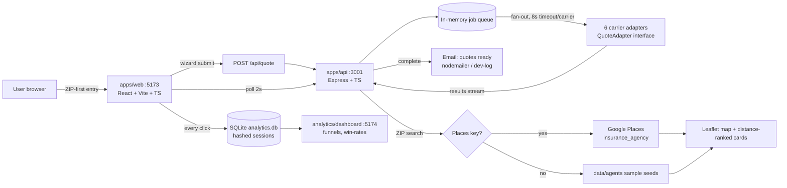

# QuotePilot — Product Case Study

> The portfolio narrative: what was built, why, and how. Every claim below is
> traceable to the code, data, or docs it names. Last updated: 2026-10-08 (v0.7.0).

## 1. The problem

Shopping for car insurance in the U.S. is miserable. To compare prices you fill
out the same long form on ten different carrier websites, wait for ten rounds of
follow-up calls, and still can't tell whether any price you got is actually good.
Most people give up after two or three quotes — and overpay for years.

Existing aggregators "solve" this by selling your phone number to lead-generation
farms. Their business model *is* the spam. QuotePilot was built on the opposite
thesis: **the comparison experience without the spam** — one form, every carrier
in your state, ranked results on-site and by email, and a local-agent directory
for the carriers that need a human. No lead-gen, no sold data, no phone-call
ambush.

**Who it's for:** any U.S. driver who suspects they're overpaying and wants proof
in minutes — starting with Massachusetts and Texas, now all 50 states.

## 2. Product decisions and why

### One form, not ten
The core insight is embarrassingly simple: carriers all ask for the same rating
factors (ZIP, drivers, vehicle, coverages). Asking once and fanning out is strictly
better than ten forms — so the product is a 5-step wizard (location → drivers →
vehicle → coverage → contact) with smart defaults, inline validation, and
localStorage resume. If you abandon it mid-way, your answers are waiting when you
come back.

### ZIP is the front door (v0.5.0)
A 5-step form is a commitment; typing a ZIP code is five seconds. The homepage
hero is now a ZIP field: enter it, and you're dropped into the wizard with the
location step prefilled. Analytics only ever sees the 3-digit prefix — the full
ZIP never leaves the quote request. *Why:* the cheapest way to reduce drop-off is
to shrink the first ask to almost nothing.

### Background fan-out, never a blocked page (v0.2.0)
Quotes run as async jobs. The UI never waits on a carrier: `POST /api/quote`
returns a job ID in milliseconds, adapters run in parallel in the background with
an 8-second per-carrier timeout, and the page polls progress. A slow or dead
carrier degrades *its own card*, never the page. *Why:* carrier sites are slow and
flaky; coupling page render to the slowest carrier would make the product feel
broken even when it works.

### Ranked results, honestly labeled (v0.2.0 → v0.7.0)
Results arrive ranked cheapest-first with coverage-match percentages, expandable
breakdowns, and a compare-up-to-3 table. Every quote surface carries two
non-negotiable labels: **"Simulated — demo pricing"** and an **"Estimates, not
offers"** disclaimer. The cheapest card says "Lowest estimate" — never "best
deal," after a v0.7.0 claims audit scrubbed guarantee language. *Why:* in
insurance, a price shown without caveats is a lie. Trust is the product.

### Unified results: online quotes + local agents (v0.5.0)
The results page has two sections: "Online quotes — instant" above "Local agents
near {ZIP} — humans who can help" (compact map + top-3 cards + deep link). *Why:*
agent-only carriers (a third of the MA market) can't be quoted online at all —
hiding them would be dishonest, and a separate Agents page would leak the
undecided user. One page, no hunting.

### Honest degradation everywhere (v0.5.0, enforced by tests)
Carriers with no pricing adapter don't get invented prices — they get an honest
"quote on their site" or "find an agent" link. Lemonade in MA is excluded entirely
(`available: false`) because Lemonade Car isn't sold there. A test
(`registry.test.ts`) enforces the law: `quotable ⟹ wired adapter`. *Why:* a
comparison site that fabricates prices is fraud with good CSS.

### Engagement without dark patterns (v0.5.0)
Live per-carrier progress rows, a savings headline computed from *real* results
("Up to $X every 6 months between the cheapest and priciest quote"), and inline
"email me when all N quotes land" capture while waiting. *Why:* waiting is the
moment users bounce — but every mechanic describes what's actually happening.
Nothing here manufactures urgency or hides the exit.

### 50-state support with honest data grades (v0.6.0)
Every state gets a carrier registry: the national core (GEICO, Progressive,
Allstate, Liberty Mutual, State Farm, Farmers, Nationwide, Travelers, USAA)
everywhere, regionals only where verified, each tagged with a confidence level.
`data/carriers/README.md` grades every state (MA/TX full, CA/NH good, 46 starter).
*Why:* launching in one state is a demo; the architecture was state-aware from
day one (rule 8), so going nationwide was a data task, not a rewrite — and the
grades keep us from pretending starter data is research.

### Compliance-first posture (v0.7.0)
Terms, Privacy, and Disclosures pages; "not a licensed producer" on every footer;
TCPA-grade consent capture; cookie consent gating analytics; per-state insurance
notes. And an explicit **attorney-review-required** rule: nothing here is legal
advice, and commercial operation is blocked until counsel reviews.
*Why:* insurance is one of the most regulated consumer products in the U.S.
Building the compliance surfaces now is cheaper than retrofitting them — and a
hiring manager can see the regulatory thinking, not just the pixels.

### No hardcoded content (v0.3.0)
The carrier marquee, FAQ answers, and JSON-LD all render from `GET
/api/carriers`. *Why:* content is data, not code — adding a state or carrier
never requires a frontend deploy.

## 3. Architecture overview

Monorepo, three runtime services, one shared contract:

**Data flow, end to end:** wizard (client-validated, server re-validates) →
`POST /api/quote` → 202 + jobId → adapters fan out per state registry →
`GET /api/quotes/:jobId` polls progress → ranked results + state disclosures →
optional email on completion → every hop emits analytics events.
See `docs/ARCHITECTURE.md` for the full treatment.

## 4. Tech stack — and why each choice

| Layer | Choice | Why |
|---|---|---|
| Frontend | React 18 + Vite 6 + TypeScript (strict) | Component model for the wizard/results complexity; Vite for instant dev + tiny prod bundles (232KB JS, under the 200KB-gzip SEO budget); strict TS catches the enum-drift class of bugs at compile time |
| Styling | Hand-rolled CSS + design tokens | No UI framework — the Apple-grade glassmorphism *is* the brand; tokens (`tokens.css`) are the visual law every screen is reviewed against |
| Maps | Leaflet + OpenStreetMap tiles | Zero API key, zero cost, no vendor lock-in; custom divIcon pins dodge bundler-broken default markers |
| Backend | Node + Express + TypeScript | One language across the monorepo; Express is boring in the best way for a JSON API with a job queue |
| Validation | zod, both ends | Single schema language; client `validation.ts` mirrors server `schemas.ts` regex-for-regex (parity is a tested law after v0.5.1 fixed four drift bugs) |
| Quote engine | Adapter pattern (`QuoteAdapter` in `packages/shared`) | **The** architectural bet: one file per carrier behind a frozen interface — real carrier APIs slot in later with zero UI or queue changes |
| Jobs | In-process bounded-concurrency queue | Demo-scale correct; narrow seam with a documented BullMQ/Redis upgrade path (`UPGRADE_PATH.md`) when multi-instance or restart-proof jobs are needed |
| Analytics store | SQLite (`better-sqlite3`) | Zero infrastructure, survives demos; summary endpoint contract is store-agnostic (Postgres/ClickHouse path documented past ~1M events/day) |
| Dashboard | Separate tiny Vite app, hand-rolled SVG charts | No chart library keeps it at 151KB; separate deployable reading one endpoint |
| Email | nodemailer (SMTP env) / dev-log mode | Real sending the moment creds exist; dev mode logs domain + jobId only — never addresses or content |
| Data | JSON registries (`data/carriers`, `data/agents`, `data/geocode`, `data/disclosures`) | Content, not code: new states/carriers ship without deploys; every file carries honesty metadata (confidence, data grade, verified flags) |
| Tests | vitest, 120+ assertions green | Adapter pricing bands, registry validity for all 50 states, route E2E, compliance surfaces |
| Hosting (prepped) | Vercel (web) + Render (API) | Free tiers, 10-minute deploy via `render.yaml` + `docs/DEPLOY.md`; env-driven CORS and `trust proxy` for correct rate limiting behind the proxy |

**Deliberately boring where it counts** (Express, SQLite, JSON files) so anyone can
run the whole thing with `npm install` and one script — **deliberately fancy
where it's visible**.

## 5. Design system thinking

The visual language lives in `docs/VISUALS.md` + `apps/web/src/styles/tokens.css`
and every screen is reviewed against it before shipping (CONTEXT rule 1):

- **Typography:** system stack (SF Pro/Inter) — native feel, zero webfont cost;
  monospace for prices so figures align; `-0.02em` heading tracking.
- **Color:** deep-navy dark-first theme, blue→violet→cyan accent gradients,
  glass cards (20px backdrop blur, 1px translucent borders). Every text token has
  a measured contrast ratio (body 15.2:1); sub-4.5:1 tokens are decorative-only
  by rule, never for reading text.
- **Shape & space:** 10/16/24px radius scale, pill CTAs, 4px-base spacing rhythm,
  1080px container — generous air, one primary action per screen.
- **Motion:** 0.15s hovers, fade+8px entrances, skeleton shimmer — all disabled
  under `prefers-reduced-motion`; nothing essential depends on animation.
- **Why dark-first:** "futuristic" reads dark, and glass/gradient effects glow
  against navy. The app is theme-adaptive (OS preference + manual override), not
  dark-only — the dark-first authorship was a brand call, adaptivity a user call.
- **Accessibility as a constraint, not a checklist:** WCAG 2.2 AA target —
  semantic landmarks, keyboard-complete flows (including the custom `Select`
  listbox), focus management per wizard step, skip links, touch targets ≥24px.
  See `docs/ACCESSIBILITY.md`.

## 6. APIs & integrations

**Current (all real, all in the repo):**

| Integration | Shape | Notes |
|---|---|---|
| Internal REST API | `POST /api/quote`, `GET /api/quotes/:jobId`, `GET /api/carriers?state=`, `GET /api/agents?state=&zip=`, `GET /api/disclosures/:state`, `POST /api/analytics/event`, `GET /api/analytics/summary`, `POST /api/email/notify`, `GET /api/health` | zod on every boundary; tiered rate limits (300/10/120 per min); full endpoint table in `docs/AI_ARCHITECTURE.md` |
| Google Places | Provider chain (`agentProvider.ts`): Nearby Search `type=insurance_agency` + Place Details, 24h cache, 10-details cap | Live only with `GOOGLE_PLACES_API_KEY`; otherwise labeled sample fallback — the key is the owner's 2-minute setup |
| SMTP | nodemailer via env | Real sends when configured; CAN-SPAM footer needs `SENDER_POSTAL_ADDRESS` before production |
| US Census Geocoder | Documented as the production replacement for the demo ZIP-centroid file | Free, no key |

**Planned (architecture ready, not built):** real carrier API integrations behind
the unchanged `QuoteAdapter` interface — the interface docstring forbids adding
required members, so existing adapters keep compiling. BullMQ/Redis for the job
queue and Postgres/ClickHouse for analytics, both with interface-preserving
migration plans already written.

## 7. SEO, analytics & dashboard strategy

- **SEO from day one** (CONTEXT rule 4): unique title/meta/OG/canonical per page
  via `react-helmet-async`, sitemap + robots.txt (quote pages and `/api/*`
  disallowed — personalized content never indexed), JSON-LD Organization + FAQ,
  one `<h1>` per page, semantic landmarks. Performance budget enforced:
  LCP < 2.5s, JS < 200KB gzip, CLS < 0.1. See `docs/SEO.md`.
- **Analytics on every interaction** (rule 6): page views, wizard steps, CTAs,
  quote lifecycle, compare opens, email opt-ins, agent phone taps, loading views —
  all funneled to SQLite with session IDs stored as truncated SHA-256 hashes and
  email-like metadata dropped on write. **Consent-gated since v0.7.0:** the cookie
  banner must be accepted before any event is sent.
- **Dashboard** (`:5174`): clicks-by-element bars, wizard funnel with % of entry,
  carrier performance (quotes, avg latency, win rate), daily sessions — hand-rolled
  SVG, 30s polling, aggregates only, no per-user drill-down by design. It's the
  product's nervous system *and* the hackathon "moat" slide.

## 8. Legal & compliance approach

QuotePilot is a comparison/lead-gen site — never an insurer, never a licensed
producer — and the product says so on every footer. The compliance build (v0.7.0)
added: Terms/Privacy/Disclosures pages, an "Estimates, not offers" doctrine on
every price, TCPA-grade consent capture (unchecked by default, named callers,
not-a-condition language), CAN-SPAM email posture, CCPA/CPRA-informed privacy,
per-state insurance notes ("Good to know in {state}") from sourced
`data/disclosures/`, and a claims audit that removed guarantee language.
**Nothing here is legal advice**: `docs/COMPLIANCE.md` §7 documents exactly what
remains for counsel — producer/lead-gen licensing per state, TCPA review, terms
enforceability — and commercial operation is blocked until a licensed attorney
reviews. See `docs/COMPLIANCE.md`.

## 9. Content feeds & freshness

| Feed | Location | Freshness story |
|---|---|---|
| Carrier registries | `data/carriers/<STATE>.json` (50 states) | National core is stable; regionals carry `confidence` flags; `data/carriers/README.md` grades every state — re-verify starter states before launch |
| Agent directory | Google Places (live) → `data/agents/<STATE>.json` (MA/TX seeds) | Places is always fresh; seeds are demo-only and badged |
| ZIP centroids | `data/geocode/zip_centroids.json` (223 ZIPs) | Demo-grade approximations; production swaps in US Census Geocoder (free, no key) |
| State disclosures & minimums | `data/disclosures/<STATE>.json` (24 states verified) | Minimums change by legislation (MA 2026, VA 2025, TN 2023 were all corrected mid-build) — re-verify against DOI guidance before launch; unverified states ship no field at all |

The standing rule: **when in doubt, leave it out** — a missing field degrades
gracefully; a guessed field is misinformation.

## 10. ZIP-code functionality

ZIP is the product's geographic key: hero entry (5-digit validated,
`inputmode="numeric"`), wizard location prefill via localStorage, quote-request
routing to the right state registry, agent geocoding via the centroid file, and
haversine distance ranking (1-decimal miles). Privacy design: analytics carries
only the 3-digit prefix; the full ZIP exists only inside the quote request, never
in logs.

## 11. Map integration

Leaflet + OSM tiles (no key, no cost) with custom numbered teardrop pins
(divIcon — the default marker PNGs break under the bundler), popups carrying
name/address/phone/hours/distance, auto-fit bounds, and reduced-motion-safe zoom.
The agent list below is the accessible equivalent of every pin — the map is never
the only path to the data (CONTEXT rule). Compact 240px variant embeds in the
results page.

## 12. The estimate engine, deep-dive

- **Contract:** `QuoteAdapter` (`packages/shared/src/types.ts`) — `quote(request,
  ctx) → Promise<QuoteResult>`. Adapters receive a sanitized `QuoteProfile`
  (age bands, vehicle class, coverages — never names, DOBs, or raw payloads).
- **Simulation pricing** (`apps/api/src/lib/pricing.ts` + `adapters/_base.ts`):
  anchored to real research — `BASE_ANCHOR = 1236` calibrates so the sample
  profile (2024 Tesla Model Y, two clean-record drivers, 50/100/50 + UM 50/100 +
  $5k med-pay + $500 comp/collision) lands Allstate at ≈$1,347/6mo, the owner's
  real October 2026 quote. Each carrier multiplies by a personality factor
  (GEICO 0.93 → cheapest-ish; Amica highest) with ±3% jitter derived from a
  SHA-256 of identity-free profile fields — **deterministic**: identical inputs
  give identical quotes, no RNG flakiness. Bands stay in the researched
  1100–1900/6mo range; outside MA they're flagged approximate.
- **Execution:** bounded-concurrency fan-out, 8s per-carrier timeout (fails closed
  into a timeout result), adapters never throw across the boundary, results
  stream to the polling UI, job completes when all settle.
- **Labeling:** `simulated: true` on every result; UI badge mandatory, verified
  in the built bundle; per-carrier caveats (telematics, underwriting review)
  ship with each quote.

## 13. What's real vs. roadmap

**Real today:** 50-state registries, 6 simulation adapters, async job engine,
ZIP-first wizard with validation parity, distance-ranked agent finder with map,
Places provider chain (key pending), analytics + dashboard, SEO/accessibility/
security pass, compliance surfaces, deploy configs.

**Roadmap (architected, not built):** real carrier API integrations (interface
frozen for it), BullMQ/Redis queue, Postgres/ClickHouse analytics, real
geocoder, production SMTP + postal address, ML pricing bands and win-rate
prediction (see `docs/AI_ARCHITECTURE.md` §5), mobile apps. Every roadmap item
has a documented insertion point — none require re-architecture.
