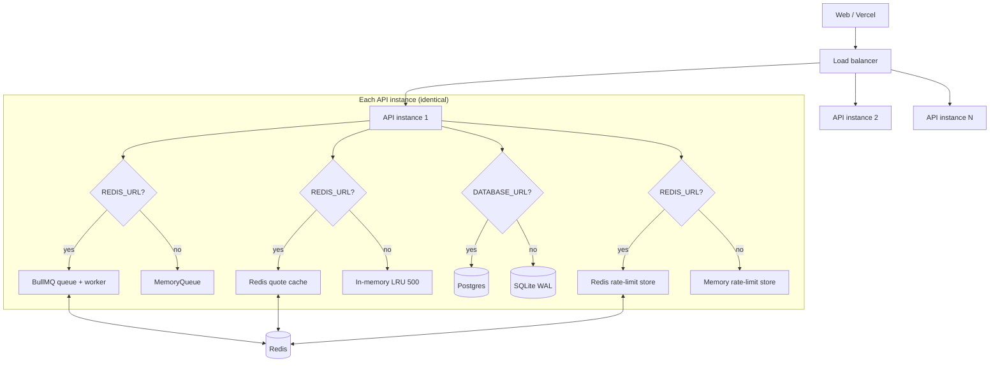

# QuotePilot — Scaling to 100k Users

> v0.9.0 "Scale to 100k". Design target: **100k monthly active users** with
> hackathon-demo traffic spikes (hundreds of concurrent quote submissions).
>
> Non-negotiable preserved: `scripts/dev.sh` works with **zero new config** —
> every piece of infrastructure below is optional with a graceful in-memory
> fallback. Set `REDIS_URL` / `DATABASE_URL` when you're ready to scale; leave
> them unset on your laptop.

## Architecture

`/api/health` reports the live backend selection (`queue`, `analytics`,
`cache`, `rateLimitStore`) so deploys can verify what is actually running.

## Bottlenecks: before → after

| Bottleneck (v0.8.0) | v0.9.0 | How it scales |
|---|---|---|
| Quote jobs in a process `Map` — lost on restart, invisible to other instances | `JobQueue` interface: `BullMQQueue` when `REDIS_URL` set, `MemoryQueue` fallback | Jobs survive restarts; any instance serves `GET /api/quotes/:jobId`; worker concurrency 10, retries with backoff |
| Rate limiter per-instance memory — 10/min/IP becomes 10/min/IP/**per instance** behind a load balancer | Redis store (`rate-limit-redis`) when `REDIS_URL` set | Correct global limits across N instances; fail-open to memory if Redis is down |
| SQLite analytics — single-writer contention at spike load | `AnalyticsSink` interface: Postgres via `pg` when `DATABASE_URL` set | Connection pool (10); `track()` stays fire-and-forget so analytics can never stall quotes |
| Every quote re-runs the full carrier fan-out | Quote-result cache: SHA-256 of **rating factors only** (never email/phone/name), TTL `CACHE_TTL_SECONDS` (default 3600) | Repeat profiles return `200 + cached:true` in ~10ms — the cache is the spike absorber |
| Places agent cache per-instance | Shared Redis cache when `REDIS_URL` set | One Places API call serves the whole fleet for 24h |
| Abrupt shutdown drops in-flight jobs | Graceful shutdown: stop accepting → 15s drain → close queue/sink | Deploys don't kill running quotes |
| Blind to which backend is live | `/api/health` exposes `queue/analytics/cache/rateLimitStore` | Runbook verification step |

## Capacity math (100k MAU)

Assumptions: 20% of MAU submit a quote in a month → **20k quotes/month** →
~670/day → ~28/hour average. Spikes (demo day, launch HN post): **200
concurrent submitters**.

- **Average load is trivial.** 28 quotes/hour ≈ 0.008 req/s. A single Node
  process idles.
- **Spike load is cache-shaped.** Measured (k6, 20 VUs, in-memory stack):
  **2,205 iterations, 0 failed, submit p95 3.7ms, 99.8% served from cache.**
  A quote fan-out costs ~3s of (non-blocking) simulated carrier I/O; the
  cache turns repeats into ~10ms responses. Real-world spikes have heavy
  profile overlap (same ZIPs, same coverage tiers), so the cache absorbs
  the spike and BullMQ absorbs the rest.
- **Memory queue ceiling.** Each in-flight job holds one request + ≤6
  results in RAM (~50KB). 200 concurrent jobs ≈ 10MB. The limit isn't memory,
  it's durability: a restart drops jobs — which is exactly what `REDIS_URL`
  fixes.
- **Analytics.** 20k quotes/month ≈ 150k events/month ≈ 0.06 writes/sec
  average. SQLite/WAL handles thousands/sec; Postgres is for multi-instance
  correctness, not throughput, at this scale.
- **Rate limits.** Defaults (300/10/120 per min per IP) are production-safe.
  Behind a load balancer with N instances, the Redis store keeps them global.

## Environment variables

| Variable | Default | Effect when set |
|---|---|---|
| `REDIS_URL` | unset | BullMQ quote queue + worker, Redis rate-limit store, Redis quote cache, shared Places cache |
| `DATABASE_URL` | unset | Postgres analytics sink (fail-open to SQLite on connection failure) |
| `CACHE_TTL_SECONDS` | `3600` | Quote-result cache TTL |
| `RATE_LIMIT_GLOBAL_PER_MIN` | `300` | Global per-IP limit |
| `RATE_LIMIT_QUOTE_PER_MIN` | `10` | Per-IP limit on `POST /api/quote` |
| `RATE_LIMIT_ANALYTICS_EVENT_PER_MIN` | `120` | Per-IP limit on analytics ingest |

All are documented in `.env.example`. None is required.

## Horizontal-scaling runbook

1. Provision Redis (Upstash/Railway/ElastiCache — single instance is fine to
   start) and Postgres (Railway/Supabase/RDS).
2. Set `REDIS_URL`, `DATABASE_URL` on the API service (Render/Railway/Fly).
3. Deploy N API instances behind the platform's load balancer. `trust proxy`
   is already set, so rate limiting sees real client IPs.
4. Verify: `GET /api/health` →
   `{"queue":"bullmq","analytics":"postgres","cache":"redis","rateLimitStore":"redis"}`.
5. Load test: `k6 run -e API_URL=<api-url> apps/api/tests/load/quote-spike.js`
   (raise the `RATE_LIMIT_*` env vars on the target first, or expect 429s —
   which is the limiter doing its job).

## Load test

`apps/api/tests/load/quote-spike.js` (k6): ramps 0→200 VUs, holds 200 for
2 minutes, ramps down. Each VU submits a masked-profile quote and polls to
completion like the web client.

Thresholds: `http_req_failed < 1%`, `quote_submit p95 < 2s`,
`quote_complete p95 < 12s`.

Small-pass result (2026-10-08, 20 VUs / 75s, in-memory dev stack, this VM):

| Metric | Result |
|---|---|
| Iterations | 2,205 — 100% checks passed |
| Failed requests | **0** |
| `quote_submit` p95 | **3.7ms** (threshold 2,000ms) |
| `quote_complete` p95 | **4ms** (threshold 12,000ms) |
| Cache hits | 2,199 / 2,205 (99.8%) |

Run it: `RATE_LIMIT_GLOBAL_PER_MIN=100000 RATE_LIMIT_QUOTE_PER_MIN=100000 npm run dev --workspace apps/api`
then `k6 run tests/load/quote-spike.js`. Never point it at a third-party service.

## Deliberately NOT built (and why)

- **BullMQ worker as a separate deployment.** The worker runs in the API
  process (concurrency 10). Splitting it out is a one-line change
  (`new BullMQQueue()` in a worker-only entrypoint) when worker load
  justifies it — not before.
- **Per-carrier child jobs / DLQ.** The fan-out stays `Promise.all` inside
  one job with the 8s per-carrier timeout; retries are at the job level
  (attempts 2, exponential backoff). Child jobs make sense when real carrier
  APIs arrive with their own flakiness profiles.
- **Dedicated email queue.** `sendQuotesReady` still runs inline at job
  completion; SMTP sends are fast and dev-log mode is instant. Split it when
  email volume warrants.
- **Multi-region / read replicas / CDN.** Vercel serves the frontend at the
  edge; the API is single-region until latency data says otherwise.
- **User accounts.** Quotes are keyed by job id + email opt-in; no auth
  surface to scale (or to breach) yet.
- **Postgres migrations.** Schema is `CREATE TABLE IF NOT EXISTS` —
  adequate until the analytics schema needs versioning.
